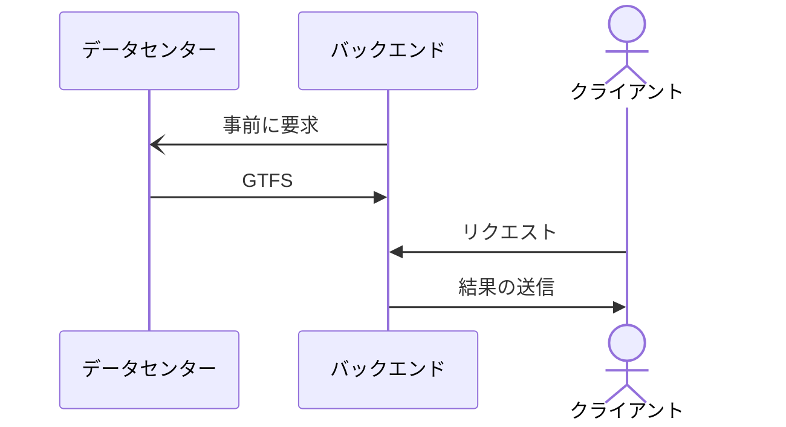

# hayakuienikaeritai
創価大学から早く八王子駅に行くプロジェクト

## これは何?
創価大学の3つのバス停から、1番早く八王子駅北口に着くバスを検索するサイト

## 流れ

1. ライブラリーで、GTFSをSQLiteに変換
---
2. DBから欲しいデータを取得
---
3. 比較、同じ便を統合
4. 出力

```mermaid
sequenceDiagram
participant データセンター
participant バックエンド
actor クライアント

バックエンド　-) データセンター : 事前に要求
データセンター ->> バックエンド : GTFS
クライアント ->> バックエンド : リクエスト
バックエンド ->> クライアント : 結果の送信

```

