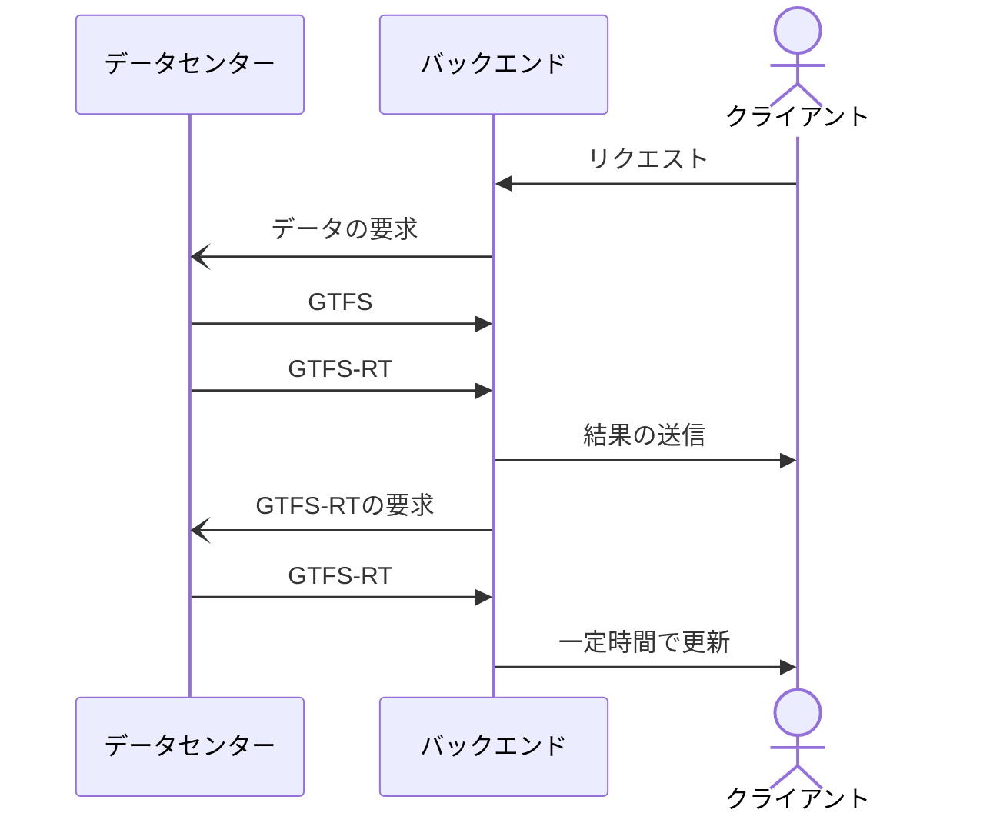

# hayakuienikaeritai
創価大学から早く八王子駅に行くプロジェクト

## これは何?
創価大学の3つのバス停から、1番早く八王子駅北口に着くバスを検索するサイト

## 流れ

```mermaid
sequenceDiagram
participant データセンター
participant バックエンド
actor クライアント

クライアント ->> バックエンド : リクエスト
バックエンド　-) データセンター : データの要求
データセンター ->> バックエンド : GTFS
データセンター ->> バックエンド : GTFS-RT
バックエンド ->> クライアント : 結果の送信
バックエンド　-) データセンター : GTFS-RTの要求
データセンター ->> バックエンド : GTFS-RT
バックエンド ->> クライアント : 一定時間で更新

```

