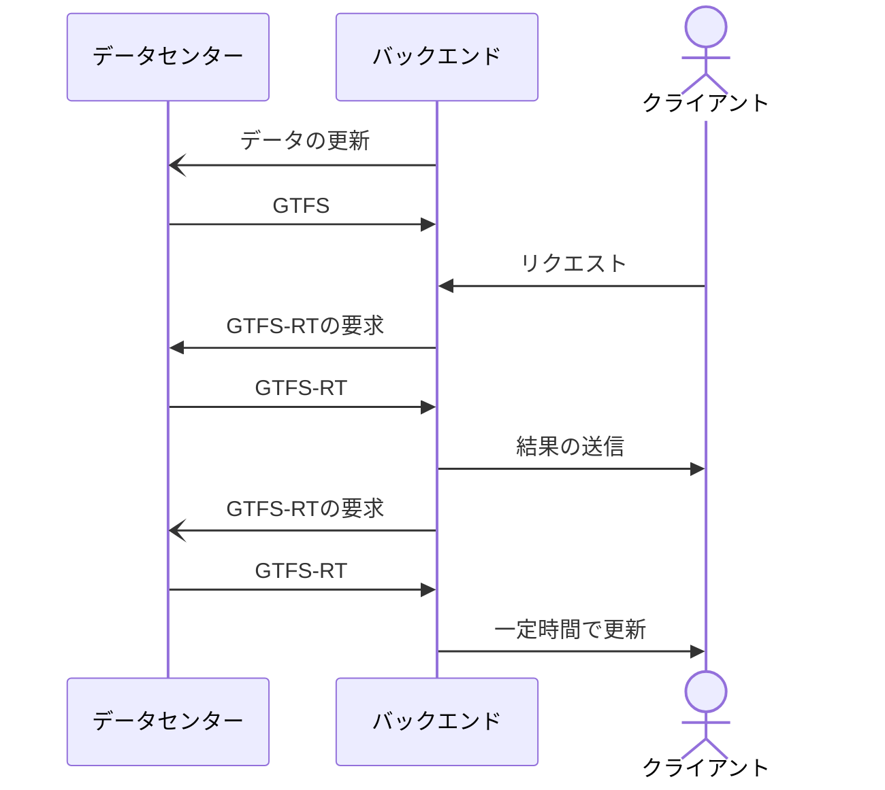

# hayakuienikaeritai
創価大学から早く八王子駅に行くプロジェクト

## これは何?
創価大学の3つのバス停から、1番早く八王子駅北口に着くバスを検索するサイト

## 流れ

1. データセンターから、GTFS(運行データ)を取得
2. ライブラリーで、GTFSをSQLiteに変換
---
3. DBから欲しいデータを取得
---
4. (仮)リアルタイムデータで上書き
---
5. 比較、同じ便を統合
6. 出力

